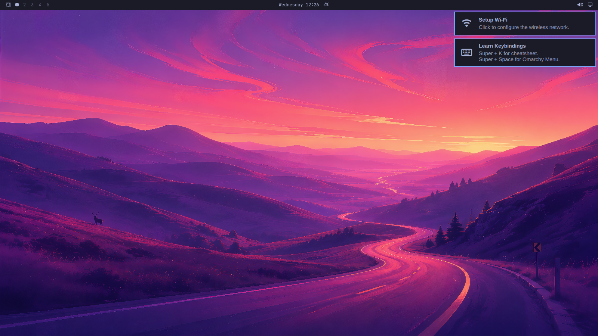

# womarchy: Omarchy on WSL, with a real GPU desktop

**Goal:** from any Windows prompt, type `omarchy`, land in the full-screen [Omarchy](https://omarchy.org) (Arch + Hyprland) desktop composited on your GPU, and return to the prompt when you log out.

**Status:** working end to end on the reference machine (Windows 11, WSL 3.0.1, RTX 5070).
- The Omarchy 4 desktop (bar, menus, launcher, terminal, Chromium, X11 apps, screenshots) runs full-screen or windowed at 60 FPS.
- Frames go through zero-copy shared memory.
- Clipboard, audio, HiDPI, multi-monitor and live display changes work.
- Not yet published: releases need a hosting decision (see [docs/PLAN.md](docs/PLAN.md)).



## Using it

```
omarchy install [Omarchy.wsl]   # import the distro, run first-time setup, add the Start menu entry and PATH
omarchy                         # start the desktop (full screen on all monitors); log out to return here
omarchy status                  # WSL, distro, GPU, shared memory, package versions
omarchy uninstall               # remove the distro (asks you to type its name)
```

- **Escape hatch:** Ctrl+Alt+End minimises the desktop to Windows. Windows keeps Win+L and Ctrl+Alt+Del for itself, so Omarchy's actions on those keys are rebound (Super+Alt+L, Super+Ctrl+Alt+Backspace).
- **Development options:** `--windowed WxH [--monitors N] [--scale S]` and `--input-script FILE` (scripted input plus in-session screenshots, see `windows/omarchy/src/script.rs`).

**Requirements:**
- Windows 11 with WSL 2.5 or newer (developed on 3.0.1).
- A GPU driver with WSL support (`/dev/dxg`).
- WSLg enabled; it's the default.

## How it works

```
omarchy.exe (Windows)                          Omarchy distro (WSL)
  per-monitor D3D11 windows  <── frames ──  Hyprland (patched) ── aquamarine "wsl" backend
  keyboard hook, mouse,        (DAX shared      renders on the GPU via Mesa d3d12 (patched),
  cursor, clipboard  ── input/ memory +         no DRM; reads back damaged regions into
                        control over hvsocket)  shared-memory buffers
```

- **Rendering:** Hyprland renders with EGL on Mesa's D3D12 driver, with no DRM device. The new aquamarine `wsl` backend puts output buffers in WSLg's section-backed virtio-fs share, which Windows maps directly (no copy crosses the VM boundary).
- **Protocol:** [protocol/wdp.h](protocol/wdp.h) runs over hvsocket (AF_VSOCK ↔ AF_HYPERV, no admin rights needed): monitors, input, frame acks, cursor, clipboard.
- **Session:** `womarchy-session` starts Omarchy the way its display manager would (`uwsm start … hyprland.desktop`) and passes back the compositor's exit status.
- **Isolation:** no custom kernel, no kernel modules, no global WSL settings. Everything lives inside the Omarchy distro and the Windows user's profile.

## Repository

- [docs/FEASIBILITY.md](docs/FEASIBILITY.md), [docs/PLAN.md](docs/PLAN.md): the study and the plan, with a status table.
- [docs/WORKLOG.md](docs/WORKLOG.md): chronological log of what was done, found and fixed.
- [docs/INSTALL-NOTES.md](docs/INSTALL-NOTES.md): the distilled, repeatable requirements (source for installers).
- `patches/`: our changes to aquamarine, Hyprland and Mesa. The forks live in `src/`, and `linux/packages/refresh-patches.sh` exports them.
- `linux/packages/`: the `[womarchy]` pacman repo, same package names as Arch: `regen-pkgbuilds.sh` then `build-all.sh`.
- `linux/overlay/`, `linux/image/`: the Omarchy WSL overlay and the `.wsl` image builder.
- `windows/omarchy/`: `omarchy.exe` (Rust), which is the viewer, launcher and installer.
- `lab/`: experiments, benchmarks and end-to-end test scripts.

**Upstream policies:**
- Mesa: AI-generated code is labelled `Generated-by: LLM`, and nothing is submitted by us.
- Hyprland/aquamarine: humans file upstream PRs.
