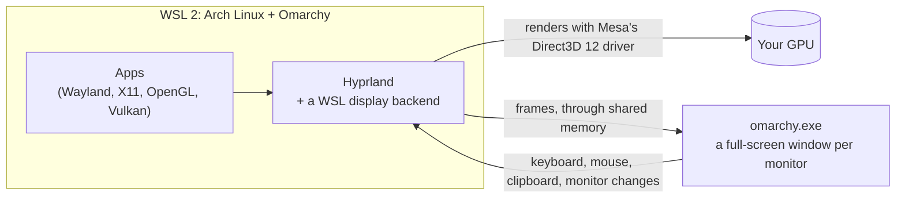

# Omarchy on WSL with full GUI and Graphics

[](https://github.com/sytelus/womarchy/actions/workflows/checks.yml)
[](https://github.com/sytelus/womarchy/releases/latest)
[](LICENSE)

**Your [Omarchy](https://omarchy.org) desktop on Windows 11, one command away.** It runs in
[WSL](https://learn.microsoft.com/windows/wsl/about), full screen on every monitor, on your GPU. No
dual boot, no reboot: type `omarchy` at any Windows prompt to get the desktop, and log out to get your
prompt back.


## Highlights

- 🖥️ **Every monitor, full screen.** Each monitor gets its native resolution and the scale Windows uses for it (mixed DPI is fine). Plug in or rearrange monitors while it runs. Tested on three 4K monitors.
- 🚀 **On your GPU.** Hyprland composites on your graphics card, and finished frames reach Windows through shared memory, without copies. OpenGL and Vulkan apps are GPU accelerated too.
- ⌨️ **One command in, log out to leave.** `omarchy` from any terminal, or **Omarchy** in the Start menu.
- 📋 **Clipboard both ways**, for text and images.
- 🔊 **Sound and microphone**, through WSL.
- 🛟 **Updates you can undo.** `omarchy update` runs Omarchy's own updater. A rollback point is recorded before every update, and `omarchy rollback` puts the previous versions back. womarchy's packages come from a signed repository.
- 💾 **Whole-distro backups** with `omarchy backup` and `omarchy restore`.
- 🧹 **Leaves Windows alone.** No custom kernel, no kernel modules, no global WSL settings. `omarchy uninstall` removes everything.

## Install

**You need:** Windows 11 and a GPU driver with WSL support (any current NVIDIA, AMD or Intel driver).

Open **PowerShell** (no need to run it as administrator) and paste:

```powershell
irm https://raw.githubusercontent.com/sytelus/womarchy/main/install.ps1 | iex
```

The installer explains what it will do and asks before changing anything. It then:
1. installs or updates WSL if needed;
2. downloads Omarchy (about 1.7 GB; it needs about 7 GB of disk);
3. asks you to choose a user name and password.

## Use

| | |
|---|---|
| Start the desktop | **Omarchy** in the Start menu, or `omarchy` in a terminal |
| Back to Windows | Log out (Super+Escape opens the system menu), or **Ctrl+Alt+End** to minimise |
| Omarchy's menu / keyboard shortcuts | Super+Space / Super+K |
| Update Omarchy | `omarchy update` (or "Update System" inside the desktop) |
| Undo the last update | `omarchy rollback` |
| Back up / restore everything | `omarchy backup` / `omarchy restore` |
| Check the installation | `omarchy status` |
| Remove everything | `omarchy uninstall` |

- Windows keeps **Win+L** and **Ctrl+Alt+Del** for itself, so Omarchy's shortcuts on those keys move to Super+Alt+L and Super+Ctrl+Alt+Backspace.
- To save download size, the image leaves out Omarchy's largest apps (LibreOffice, OBS, Kdenlive, ...). Install any of them from Omarchy's menu.

Problems? See [Troubleshooting](docs/TROUBLESHOOTING.md).

> [!WARNING]
> **Work in progress, and so far it "works on my machine".** It was developed and tested on one PC
> (Windows 11, NVIDIA RTX 5070, three 4K monitors). Expect rough edges elsewhere, and please
> [tell us](https://github.com/sytelus/womarchy/issues/new/choose) how it went.
> - **WSL gets upgraded.** womarchy needs WSL 3.0.1 or later, so the installer updates WSL (or installs it). Your other WSL distros keep their files, but WSL restarts and anything running in it stops. Windows asks for administrator permission and may need a restart.
> - Some Ubuntu distros then report a harmless `degraded` state; [here's the fix](docs/TROUBLESHOOTING.md#other-wsl-distros-after-the-wsl-update).
> - womarchy adds a WSL distro named "Omarchy", a Start menu entry and the `omarchy` command for your user. Nothing else on Windows changes.
>
> An unofficial project, not affiliated with Omarchy or Basecamp.

## How it works



Hyprland normally needs display hardware, which WSL doesn't have. womarchy adds a display backend that
hands each finished frame to `omarchy.exe` on Windows through memory both sides can see, so nothing
is copied on the way. `omarchy.exe` shows each monitor's frames in a full-screen window and sends
keyboard, mouse and clipboard events back.

**Good to know:**
- **Chromium draws pages on the CPU.** Everyday browsing is fine, but 3D web pages (WebGL) need [a flag](docs/TROUBLESHOOTING.md#using-the-desktop).
- **Games:** OpenGL and Vulkan run through Direct3D 12, which suits apps and light 3D more than serious gaming.
- **Windows owns the hardware.** Wi-Fi, Bluetooth, power and the kernel are managed by Windows, so the matching Omarchy menu entries don't apply.

Want the details? Start with [the journey](docs/JOURNEY.md), the story of how this was built: the dead
ends, the bugs and how each was found. Then see [the architecture](docs/ARCHITECTURE.md).

## Documentation

| | |
|---|---|
| [Troubleshooting](docs/TROUBLESHOOTING.md) | Logs, common problems, updates and rollback, fixes for other distros after the WSL update, manual removal |
| [The journey](docs/JOURNEY.md) | How it was built: insights, bugs, how they were debugged and fixed |
| [Architecture](docs/ARCHITECTURE.md) | Components, session lifecycle, frames, input, DPI, updates, security model |
| [Development](docs/DEVELOPMENT.md) | Building, testing, CI, changing the protocol, releasing |
| [Patches](patches/README.md) and [upstreaming](docs/UPSTREAMING.md) | What we change in aquamarine, Hyprland and Mesa, and how it goes upstream |
| [Feasibility study](docs/FEASIBILITY.md), [plan](docs/PLAN.md), [work log](docs/WORKLOG.md), [install notes](docs/INSTALL-NOTES.md) | The research, the plan and its status, the full dated record, and the distilled install requirements |

## Contributing

**Issues are the way to contribute.** [Open an issue](https://github.com/sytelus/womarchy/issues/new/choose)
for bugs, ideas, or a test report from your machine (what worked is useful too). We don't accept pull
requests directly: if you have a fix, describe it in an issue, with a link to your branch if you like.
See [CONTRIBUTING.md](CONTRIBUTING.md). Security problems: [SECURITY.md](SECURITY.md).

## Thanks

womarchy stands on [Omarchy](https://github.com/omacom/omarchy), [Hyprland](https://hypr.land),
[Mesa](https://mesa3d.org) and [WSL](https://github.com/microsoft/WSL) with
[WSLg](https://github.com/microsoft/wslg). Our small patches to them are in [patches/](patches/).

## License

MIT (see [LICENSE](LICENSE)). The patches keep their upstream projects' licenses. Omarchy and the Arch
packages in the image are under their own licenses.
