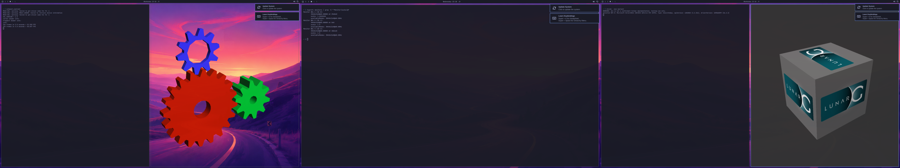

# Omarchy on WSL

Run [Omarchy](https://omarchy.org), the Arch Linux + Hyprland desktop, on Windows 11, full screen on
all your monitors, composited on your GPU. Type `omarchy` at any Windows prompt to get the desktop; log
out to get your prompt back. (An unofficial project, not affiliated with Omarchy or Basecamp.)



> [!WARNING]
> **Early preview.** It works well on the machine it was developed on (Windows 11, NVIDIA RTX 5070,
> three 4K monitors), but has had little testing elsewhere. Before installing, know that:
> - **The installer updates WSL if yours is older than 3.0.1, or installs it.**
>   - This affects all your WSL distros: they keep their files, but WSL restarts (anything running in it stops). Windows asks for administrator permission and may need a restart.
>   - Some Ubuntu distros report a harmless `degraded` state on WSL 3.0.1; [here's the fix](docs/TROUBLESHOOTING.md#other-wsl-distros-after-the-wsl-update).
> - It downloads about 1.7 GB and needs about 7 GB of disk.
> - It adds a WSL distro named "Omarchy", plus a Start menu entry and the `omarchy` command for your user. Nothing else on Windows changes, and `omarchy uninstall` removes it all.

## Install

**You need:** Windows 11 and a GPU driver with WSL support (any current NVIDIA, AMD or Intel driver).

Open **PowerShell** (no need to run it as administrator) and paste:

```powershell
irm https://raw.githubusercontent.com/sytelus/womarchy/main/install.ps1 | iex
```

The installer:
1. explains what it will do and asks before changing anything;
2. installs or updates WSL if needed;
3. downloads Omarchy;
4. asks you to choose a user name and password for it.

## Use

| | |
|---|---|
| Start the desktop | **Omarchy** in the Start menu, or `omarchy` in a terminal |
| Back to Windows | Log out (Super+Escape opens the system menu), or **Ctrl+Alt+End** to minimise |
| Omarchy's menu / keyboard shortcuts | Super+Space / Super+K |
| Check the installation | `omarchy status` |
| Remove everything | `omarchy uninstall` |

- Windows always keeps **Win+L** (lock) and **Ctrl+Alt+Del** for itself, so Omarchy's shortcuts on those keys move to Super+Alt+L and Super+Ctrl+Alt+Backspace.
- Copy and paste work between Windows and Omarchy (text).
- To save download size, the image leaves out Omarchy's largest apps (LibreOffice, OBS, Kdenlive, ...). Install any of them from Omarchy's menu.

Problems? See [Troubleshooting](docs/TROUBLESHOOTING.md).

## How it works

Hyprland runs inside WSL on your GPU (through Mesa's Direct3D 12 driver), with no display hardware of
its own. A new backend hands each finished frame to `omarchy.exe` through memory shared with Windows
(zero-copy). `omarchy.exe` shows it in a full-screen window on each monitor and sends keyboard and mouse
input back. Each monitor gets the scale Windows uses for it. Details: [Architecture](docs/ARCHITECTURE.md).

No custom kernel, kernel modules or global WSL settings are involved.

## Documentation

| | |
|---|---|
| [Troubleshooting](docs/TROUBLESHOOTING.md) | Logs, common problems, fixes for other distros after the WSL update, manual removal |
| [Architecture](docs/ARCHITECTURE.md) | Components, session lifecycle, frames, input, DPI, security model |
| [Development](docs/DEVELOPMENT.md) | Building, testing, changing the protocol, releasing |
| [Patches](patches/README.md) and [upstreaming plan](docs/UPSTREAMING.md) | What we change in aquamarine, Hyprland and Mesa, and how it goes upstream |
| [Feasibility study](docs/FEASIBILITY.md), [plan](docs/PLAN.md), [work log](docs/WORKLOG.md), [install notes](docs/INSTALL-NOTES.md) | The research, the plan and its status, what was done and found, and the distilled install requirements |

## License

MIT (see [LICENSE](LICENSE)). The patches keep their upstream projects' licenses. Omarchy and the Arch
packages in the image are under their own licenses.
